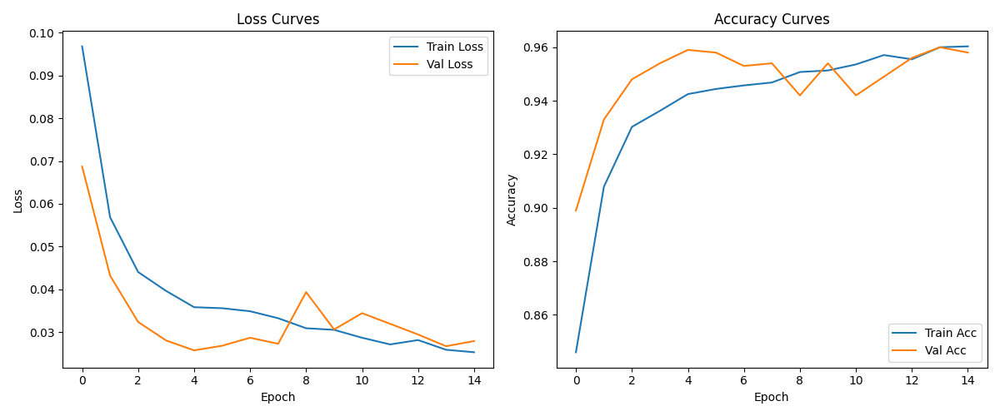

[English](README.md) | [中文](README_zh.md)

# ResViTM-Net: Where Local Features Meet Global Context, Guided by Patient Priors for Medical Vision

## 🚀 Introduction

ResViTM-Net is a novel hybrid deep learning model designed for automatic Tuberculosis (TB) detection. It skillfully combines local features from CNNs, global context from ViTs, and patient clinical prior information. On three public datasets, the model achieves an overall accuracy of 96.0%, significantly outperforming various baseline models while also realizing faster training speed.

This project is the code implementation for ResViTM-Net.

## 🔧 Environment Setup

  - **OS:** Ubuntu 22.04 (WSL2)
  - **Hardware Recommendation:** GPU with at least 16GB of VRAM
  - **Python Version:** 3.12.9

It is recommended to use Anaconda to create an isolated Python environment.

```bash
conda create -n ResViTM python=3.12.9
conda activate ResViTM
```

Install the main dependencies:

```bash
pip install -r requirements.txt
```

## 📂 Dataset Preparation

The three datasets used in the paper have been consolidated and can be downloaded from the [project's Releases page](https://github.com/Vanilla-Yukirin/ResViTM-Net/releases).

Please download the data and organize it in the `data` directory according to the following structure:

```
data
│
├── ChinaSet_AllFiles
│   ├── ClinicalReadings
│   └── CXR_png
│
├── MontgomeryCXR
│   └── MontgomerySet
│       ├── ClinicalReadings
│       └── CXR_png
│
└── TB_Chest_Radiography_Database
    ├── Normal
    └── Tuberculosis
```

## 🏃‍♂️ Data Preprocessing

The scripts related to data preprocessing are located in the `data_process` directory.

### CNN Inversion Model

These scripts are used to train and apply a CNN-based inversion model.

```bash
python data_process/train_INV_CNN.py
python data_process/use_INV_CNN.py
```

### U-Net Lung Lobe Segmentation Model

These scripts are for training a U-Net-based lung lobe segmentation model and reconstructing the dataset based on the segmentation results.

```bash
python data_process/train_unet.py
python data_process/Rebuild_Dataset.py 
```

## 🔬 Training ResViTM

Run the following command to start training the main model:

```bash
python ResViTM-Net/train_ResViTM.py
```

The training report will be saved as a text file in the `report` directory. Model weights and Loss/Accuracy curves will be saved in the `model_output` directory. An image of the output curve:



### Adjusting the Loss Function

Training scripts for ResViTM models using different loss functions are located in the `ResViTM-Net/Adjust_Loss` directory. For example:

```bash
python ResViTM-Net/Adjust_Loss/BCELoss.py
```

### Ablation Studies and GradCAM

Code related to ablation studies and GradCAM heatmap visualization is located in the `ResViTM-Net/Ablation` directory. For example:

```bash
python ResViTM-Net/Ablation/woRes.py
python ResViTM-Net/Ablation/woRes_GradCAM.py
```

## 📈 Other Experiments

### Model Comparison

Scripts for comparing different models are located in the `model_compare` directory. For example:

```bash
python Model_Compare/Resnet18.py
```

### T-SNE Visualization

Scripts for T-SNE visualization are located in the `T-SNE` directory. For example:

```bash
python T-SNE/Resnet18.py
```

The T-SNE visualization results will be saved in the `t-SNE_output` directory.