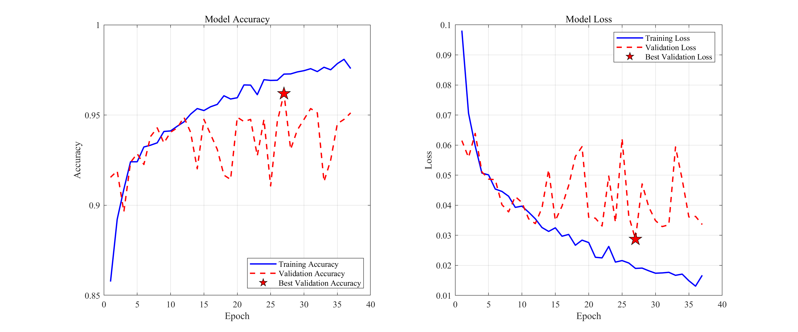
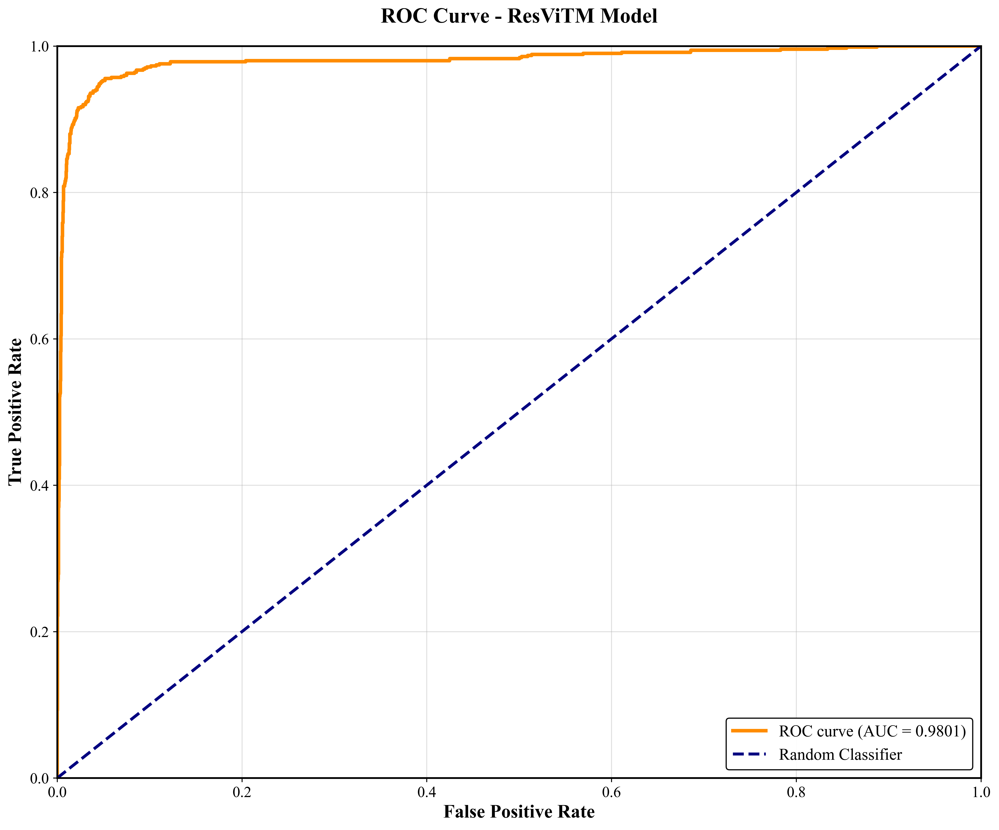

[English](README.md) | [中文](README_zh.md)

# ResViTM-Net: 融合局部特征与全局上下文，由患者先验引导的医学视觉模型

## 🚀项目简介

ResViTM-Net 是一个为肺结核（TB）自动检测而设计的新型混合深度学习模型，它巧妙地结合了卷积网络 (CNN) 的局部特征、视觉变换器 (ViT) 的全局上下文以及患者的临床先验信息。该模型在三个公开数据集上达到了 96.0% 的总体准确率，性能显著超过了多种基准模型，且实现了更快的训练速度。

本项目为 ResViTM-Net 的代码实现。

## 🔧 环境配置

  - **操作系统**：Ubuntu 22.04 (wsl2)
  - **硬件建议**：具有16G显存
  - **Python版本**：3.12.9

推荐使用 Anaconda 安装独立的 Python 环境。

```bash
conda create -n ResViTM python=3.12.9
conda activate ResViTM
```

安装主要依赖：

```bash
pip install -r requirements.txt
```

## 📂 数据集准备

论文使用的三个数据集已被整合，可在[本项目的Releases页面](https://github.com/Vanilla-Yukirin/ResViTM-Net/releases)中下载。

请将下载的数据按以下结构存放在 `data` 目录下：

```
data
│
├── ChinaSet_AllFiles
│   ├── ClinicalReadings
│   └── CXR_png
│
├── MontgomeryCXR
│   └── MontgomerySet
│       ├── ClinicalReadings
│       └── CXR_png
│
└── TB_Chest_Radiography_Database
    ├── Normal
    └── Tuberculosis
```

## 🏃‍♂️ 数据预处理

数据预处理相关的代码存放于 `data_process` 目录下。

### CNN反演模型

这两个脚本用于训练并应用一个基于CNN的反演模型。

```bash
python data_process/train_INV_CNN.py
python data_process/use_INV_CNN.py
```

### U-Net肺叶分割模型

这两个脚本用于训练基于U-Net的肺叶分割模型，并重建数据集。

```bash
python data_process/train_unet.py
python data_process/Rebuild_Dataset.py 
```

## 🔬 正式训练ResViTM

```bash
python ResViTM-Net/train_ResViTM.py
```

训练报告会输出并以文本文件的形式保存在report目录下；模型权重文件与Loss/Acc曲线会保存在model_output目录下。如下是Loss/Acc曲线的示例：



### 绘制ROC曲线

为已训练好的ResViTM模型生成并保存ROC曲线（PDF）：

```bash
python ResViTM-Net/ROC/ROC.py
```

示例输出：



### 数据增强策略实验

运行数据增强策略实验，生成对应的模型与报告：

```bash
python ResViTM-Net/Augmentation_analysis/Augmentation_analysis.py
```

### 调整Loss函数

使用其他Loss函数的ResViTM模型训练代码存放在 `ResViTM-Net/Adjust_Loss` 目录下。例如：

```bash
python ResViTM-Net/Adjust_Loss/BCELoss.py
```

### 调整SmoothL1Loss的Beta参数

调整 ResViTM 所使用的SmoothL1Loss 函数的超参数 beta，使用 MoreBeta 脚本：

```bash
python ResViTM-Net/MoreBeta/MoreBeta.py -b 0.5
```

beta 参数的范围为 [0.0, 1.0]，且必须保留一位小数（例如 0.0、0.5、1.0）。

### 消融实验与GradCAM

消融实验与GradCAM热力图可视化相关代码存放在 `ResViTM-Net/Ablation` 目录下。例如：

```bash
python ResViTM-Net/Ablation/woRes.py
python ResViTM-Net/Ablation/woRes_GradCAM.py
```

## 📈 其他实验

### 模型对比

模型对比相关代码存放在 `model_compare` 目录下。例如：

```bash
python Model_Compare/Resnet18.py
```

### T-SNE可视化

T-SNE可视化相关代码存放在 `T-SNE` 目录下。例如：

```bash
python T-SNE/Resnet18.py
```

T-SNE可视化结果会保存在 `t-SNE_output` 目录下。

